<div align="center">

# 🛡️ Wazuh SIEM Cybersecurity Lab
### Enterprise-Grade Security Monitoring · Firewall Hardening · Attack Simulation
### *Deploy. Defend. Detect.* 🔐

[]()
[]()
[]()
[]()
[]()
[]()

</div>

---

## 🔐 What is this lab?

> *A real enterprise-grade cybersecurity lab — built from scratch, not just watched on YouTube.*

This lab demonstrates a **complete Blue Team security workflow** — from deploying a SIEM platform, hardening a Linux server with firewall rules, to simulating real attacker reconnaissance from Kali Linux and analysing the results.

Every screenshot in this repo is from a **live lab environment** — real commands, real output, real security work. 🛡️

---

## 🏗️ Lab Architecture

```
┌─────────────────────────────────────────┐
│           VirtualBox Environment         │
│                                         │
│  ┌─────────────────┐  ┌──────────────┐  │
│  │  Ubuntu Server   │  │  Kali Linux  │  │
│  │                 │  │  (Attacker)  │  │
│  │  • Wazuh SIEM   │  │              │  │
│  │  • Wazuh Manager│  │  • Nmap      │  │
│  │  • Dashboard    │  │  • Recon     │  │
│  │  • IPTables FW  │  │  • Enum      │  │
│  └────────┬────────┘  └──────┬───────┘  │
│           │                  │          │
│           └──────────────────┘          │
│              Network Traffic            │
└─────────────────────────────────────────┘
```

---

## 📁 Lab Structure

```
wazuh-siem-cybersecurity-lab/
│
├── WAZUH/
│   ├── 01-virtualbox-lab.png
│   ├── 02-ubuntu-terminal.png
│   ├── 03-server-ip-address.png
│   ├── 04-wazuh-installation-history.png
│   ├── 05-wazuh-manager-running.png
│   ├── 06-wazuh-dashboard-running.png
│   └── 07-wazuh-login-page.png
│
├── IPTABLES/
│   ├── 09-iptables-installation.png
│   ├── 10-firewall-default-policies.png
│   ├── 11-iptables-ssh-rule.png
│   ├── 12-iptables-web-rules.png
│   └── 13-invalid-packet-rule.png
│
├── ATTACK_SIMULATION/
│   ├── 19-kali-ip-address.png
│   ├── 20-kali-connectivity-test.png
│   ├── 21-kali-nmap-attack.png
│   ├── 22-kali-service-enumeration.png
│   └── 23-kali-advanced-reconnaissance.png
│
└── README.md
```

---

## ☁️ Phase 1 — Wazuh SIEM Deployment

> Setting up the security monitoring platform on Ubuntu Server

### What I did:
- Set up **VirtualBox** lab environment with Ubuntu Server and Kali Linux VMs
- Configured **server IP address** for network connectivity between machines
- Installed **Wazuh Manager** and verified all services running
- Deployed **Wazuh Dashboard** and confirmed web interface accessible
- Verified full SIEM stack operational via login page

### 📸 Evidence

| Step | Screenshot |
|---|---|
| 01 — VirtualBox lab setup | 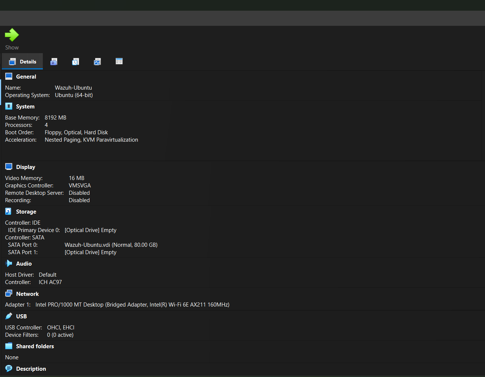 |
| 02 — Ubuntu terminal access | 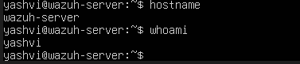 |
| 03 — Server IP configured | 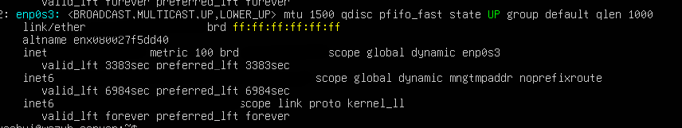 |
| 04 — Wazuh installation history | 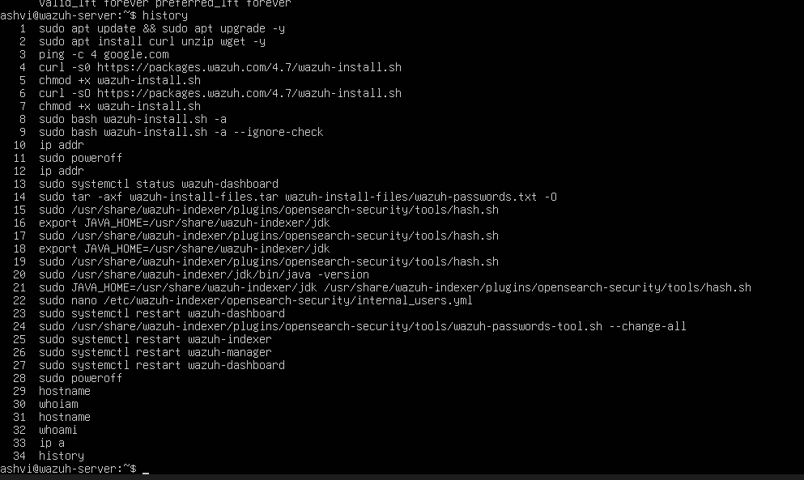 |
| 05 — Wazuh manager running | 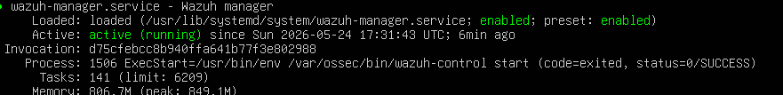 |
| 06 — Dashboard running | 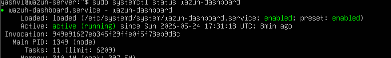 |
| 07 — Wazuh login page live | 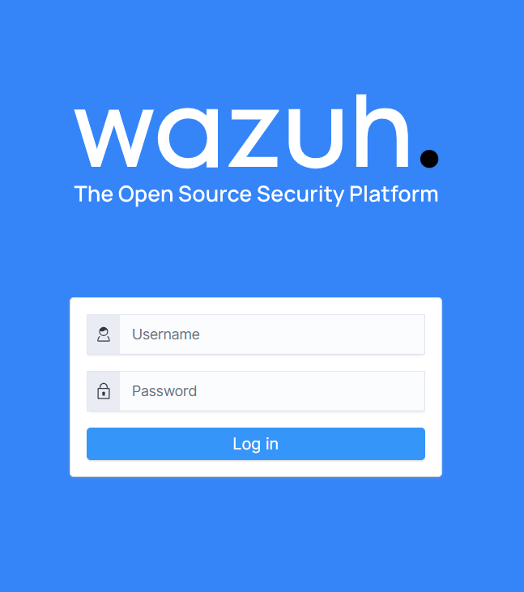 |

---

## 🔥 Phase 2 — IPTables Firewall Hardening

> Configuring Linux firewall rules to protect the Ubuntu Server

### What I did:
- Installed **IPTables** firewall on Ubuntu Server
- Set **default DROP policies** — all traffic blocked unless explicitly allowed
- Configured **SSH access rule** — secure remote management only
- Added **HTTP/HTTPS web rules** — controlled web traffic
- Implemented **invalid packet filtering** — drops malformed/suspicious packets

### Firewall Rules Summary:
```bash
# Default policies — deny everything
iptables -P INPUT DROP
iptables -P FORWARD DROP
iptables -P OUTPUT DROP

# Allow SSH
iptables -A INPUT -p tcp --dport 22 -j ACCEPT

# Allow HTTP & HTTPS
iptables -A INPUT -p tcp --dport 80 -j ACCEPT
iptables -A INPUT -p tcp --dport 443 -j ACCEPT

# Drop invalid packets
iptables -A INPUT -m state --state INVALID -j DROP
```

### 📸 Evidence

| Step | Screenshot |
|---|---|
| 09 — IPTables installation | 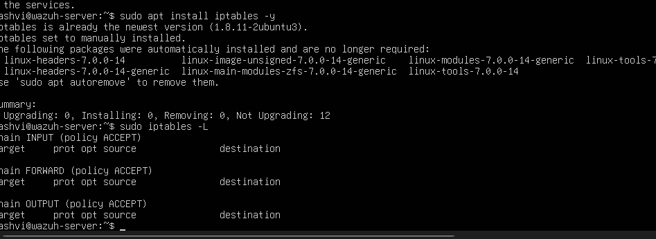 |
| 10 — Default DROP policies set | 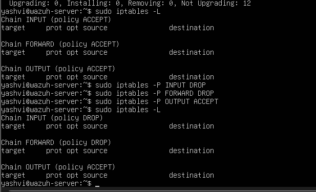 |
| 11 — SSH rule configured | 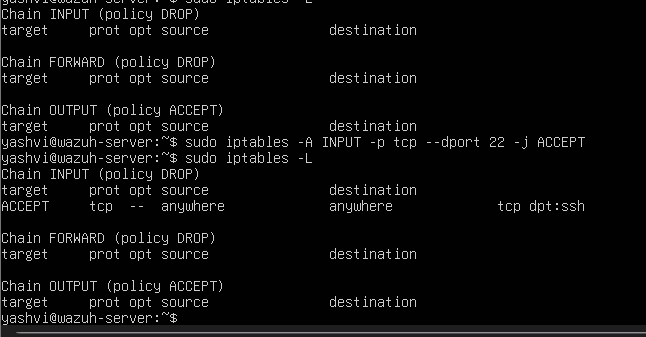 |
| 12 — Web traffic rules | 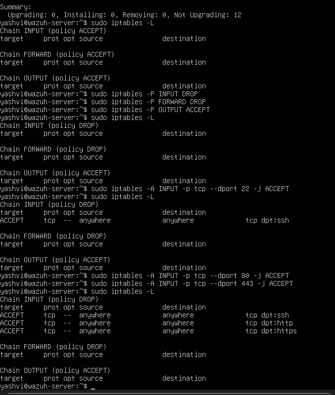 |
| 13 — Invalid packet rule | 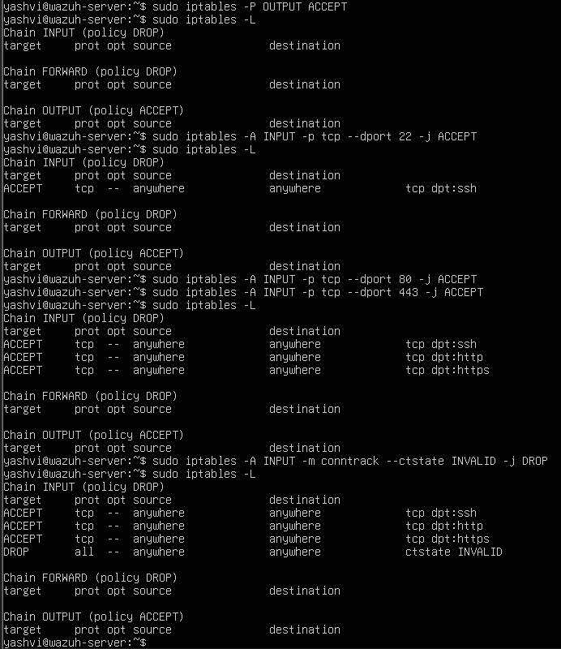 |

---

## ⚔️ Phase 3 — Attack Simulation from Kali Linux

> Simulating real attacker reconnaissance to test firewall effectiveness

### What I did:
- Configured **Kali Linux VM** with IP address in the same network
- Ran **connectivity tests** to confirm attacker can reach target
- Executed **Nmap port scan** attack against Ubuntu Server
- Performed **service enumeration** to identify running services
- Ran **advanced OS detection & aggressive reconnaissance** scan

### Attack Commands Used:
```bash
# Basic connectivity test
ping <ubuntu-server-ip>

# Nmap port scan
nmap <ubuntu-server-ip>

# Service enumeration
nmap -sV <ubuntu-server-ip>

# Advanced reconnaissance
nmap -A -O <ubuntu-server-ip>
```

### 📸 Evidence

| Step | Screenshot |
|---|---|
| 19 — Kali IP configured | 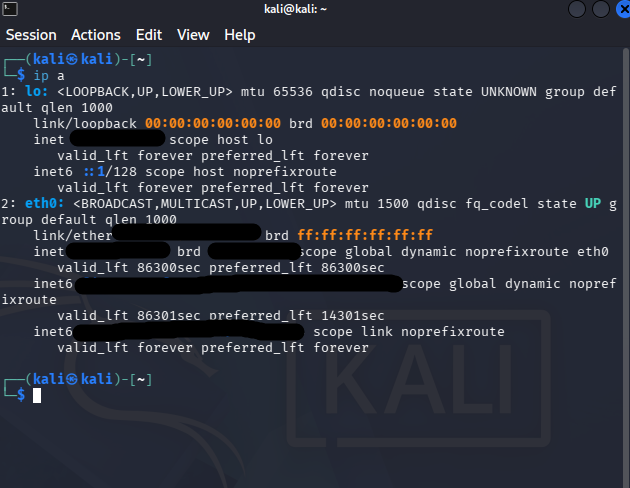 |
| 20 — Connectivity test | 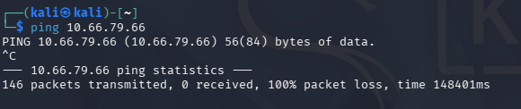 |
| 21 — Nmap attack launched | 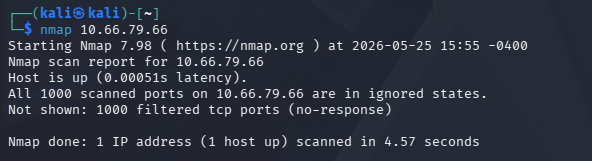 |
| 22 — Service enumeration | 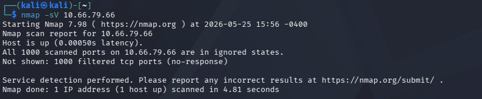 |
| 23 — Advanced reconnaissance | 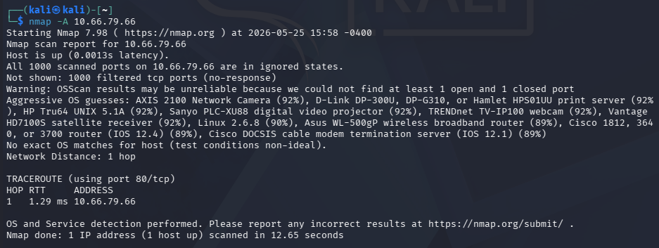 |

---

## 📊 Key Results

| Test | Without Firewall | With IPTables |
|---|---|---|
| Open ports visible | All ports exposed | Only allowed ports visible |
| Service details | Fully enumerated | Significantly limited |
| OS detection | Successful | Blocked/limited |
| Attack surface | High | Greatly reduced |

> ✅ **Conclusion:** IPTables firewall successfully reduced information disclosure and limited attacker visibility during all reconnaissance phases.

---

## 🛠️ Tools & Technologies

| Tool | Purpose |
|---|---|
| 🔵 **Wazuh SIEM** | Security monitoring & alert management |
| 🟠 **Ubuntu Server** | Target machine & SIEM host |
| 🐉 **Kali Linux** | Attacker machine — reconnaissance & scanning |
| 🔥 **IPTables** | Linux firewall — packet filtering & hardening |
| 🗺️ **Nmap** | Network scanning & service enumeration |
| 📦 **VirtualBox** | Virtual lab environment |

---

## 💡 What I Learned

- Deploying a **production-grade SIEM** (Wazuh) from scratch on Linux
- Configuring **IPTables firewall** with default-deny security posture
- Understanding **attacker reconnaissance techniques** used in real penetration tests
- Analysing how **firewall rules reduce attack surface** against Nmap scans
- Building a **complete Blue Team lab** — monitor, defend and test

---

## 🔗 Related Security Projects

| Project | Stack |
|---|---|
| [Operation Fire — Blue Team Lab](https://github.com/yashvi-create/operation-fire-blue-team-lab) | Kali Linux · Sysmon · PowerShell · SIEM |
| [Phoenix Gateway — HA Architecture](https://github.com/yashvi-create/phoenix-gateway-aws) | CloudFront · S3 · High Availability |

---

## 👩‍💻 Built By

<div align="center">

**Yashvi Thakar** — Cloud & DevOps Engineer | Cybersecurity Enthusiast

[](https://www.linkedin.com/in/yashvithakar/)
[](https://github.com/yashvi-create)

*Build. Automate. Repeat.* ☁️✨

</div>
